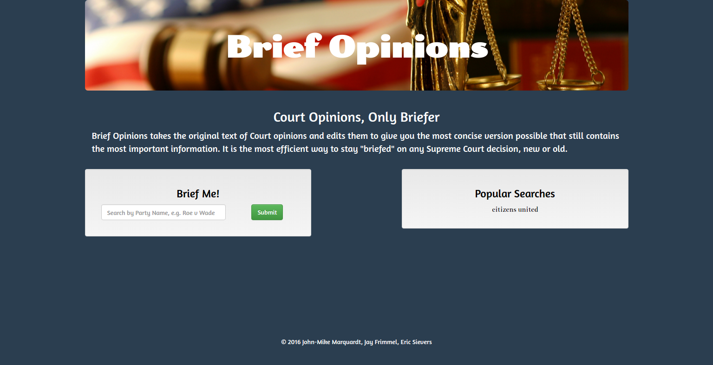
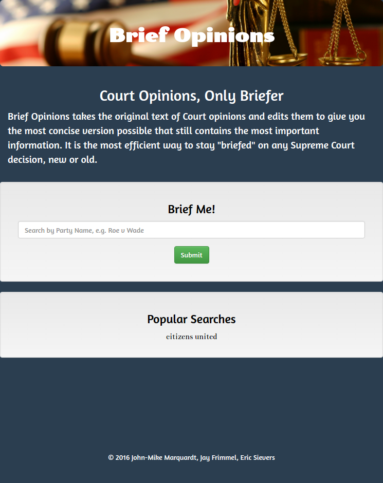

# Brief Opinions
Brief Opinions is an app that searches court cases and returns a summarized opinion via the courtlistener API and the Intellexer Summarizer API.

## Screenshots
### Desktop

### Mobile

## Technologies Used
* JavaScript
* HTML
* CSS
* jQuery
* Ajax
* Firebase
* Court Listener REST API (https://www.courtlistener.com/api/rest-info/)
* Intellexer Summarizer API (https://http://esapi.intellexer.com/Summarizer) 
* twitter Bootstrap (http://getbootstrap.com/)
* Trello
* Slack

## Overall Concept
Brief Opinions utilizes the Intellexer Summarizer API, which summarizes text, along with the Court Listener API, which is a searchable database of court opinions. 
This application first uses the CourtListener API to return JSON objects (populating a search result table) based on the users search term.  These objects contain the absolute URL of the site displaying the full court opinion.  Brief Opinions does not however, direct the user off our site and onto that URL, but rather employs Intellexer Summarizer to return a second object with the summary of the URL’s content (the actual court opinion).  The application then writes the content of that object (the summarized opinion) into the html of our page. 

## Target User
Law Students, Lawyers, and anyone interested in gleaning a quick understanding of a Supreme Court Opinion through a summarized version of its original language.  

## Problem Solved
Brief Opinions saves time by giving its users the ability to glean key information from a Supreme Court Decision in less time than it would take to read the entire opinion.  Entire opinions can contain anywhere from 4,000 words to 50,000 words.  This app uses a free, publicly available court database api (courtlistener.com) and summarizes these opinions down to 10 sentences via the Intellexer Summarizer api.

## Built With
* Sublime
* Google Firebase
* Twitter Bootstrap

## Authors
* John-Mike Marquardt @codemarq
* Eric Sievers @goodtuesday
* Jay M. Frimmel @JayMFrimmel

## Acknowledgements
* Eric Sievers: Concept, Firebase, Presentation
* Jay M. Frimmel: Main HTML, CSS, Bootstrap, images and design
* John-Mike Marquardt: Javascript, jQuery, Trello, some HTML/CSS, project manager

